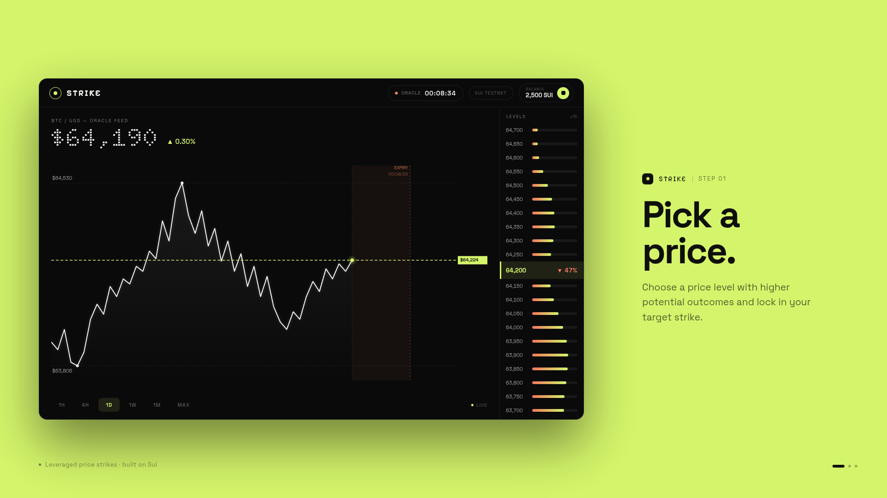

# Strike

**Designed for high-conviction traders with limited capital.**

The first leveraged trading platform for BTC prediction markets on Sui. Strike lets traders collateralize SUI to open leveraged positions on [DeepBook Predict](https://github.com/MystenLabs/deepbookv3) markets.

  

 

When a user deposits SUI, Strike executes the **Margin Loop** in a single Move transaction:

1. **Borrow** — draw dBUSDC from DeepBook Margin against SUI collateral
2. **Swap** — exchange dBUSDC for the target asset via DeepBook
3. **Deploy** — open a leveraged position on DeepBook Predict

Positions are continuously scored by an on-chain kinked interest rate **Health Factor**. Undercollateralized positions can be liquidated by any permissionless keeper bot, which earns a **2% FIFO fee** — no centralized clearinghouse required.

---

## Packages

### `contracts/`
The core Move package. Manages the full position lifecycle (`PENDING_OPEN → OPEN → CLOSED / LIQUIDATED`), computes the on-chain health factor, and orchestrates cross-protocol calls across DeepBook Margin and Predict in a single atomic transaction.

### `backend/`
User-facing Fastify API. Implements a server-custodial zkLogin flow via Enoki — the server holds the ephemeral key, builds the ZK proof, and sponsors every transaction so users never need gas. Handles auth, position intents, and delegates execution to the keeper.

### `keeper/`
Permissionless off-chain service that executes the Margin Loop and monitors open positions. On open: borrows dBUSDC, swaps, and deploys into Predict. On close: unwinds and repays. Also scans for undercollateralized positions and triggers liquidation to earn the protocol fee.

### `frontend/`
React 19 trading UI. Google sign-in (no wallet required), position dashboard, and market browser. Communicates exclusively with the backend — users interact with the chain without ever touching a transaction directly.
